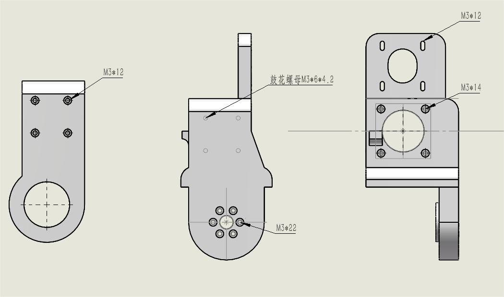
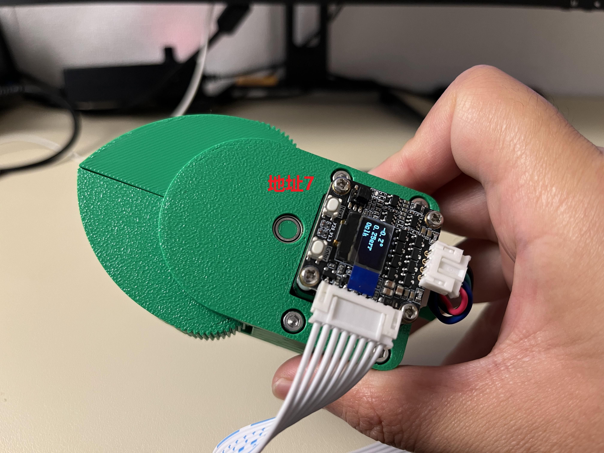

# jyker机械臂

#### 硬件介绍
jyker 机械臂是一款开源的3D 打印机械臂，硬件分为4个部分
1.  3D打印的骨架 ，可以打开models 文件夹查看，也可以在makerworld上可以直接打印，传送门：https://makerworld.com.cn/zh/models/958314#profileId-973439
2.  3D打印的减速机4个以及金属减速机1个，也可以直接在makerworld上直接找到：https://makerworld.com.cn/zh/models/807709#profileId-785035
3.  FOC 板子可以上淘宝购买：https://item.taobao.com/item.htm?abbucket=17&id=975169994702 
或者去立创开源广场获取制板文件：https://oshwhub.com/dashuaibran/works ， 
FOC电机源码在firmware/CtrlStepDriver 目录下，
电机上位机源码在 MotorControl 目录下

#### 螺钉安装（打印减速器版本）

#### 螺钉安装（金属减速器版本）

#### 电机对应位置以及ID设置

#### 夹爪

1.  模型在models/Claw 下面，也可以在makerworld上可以直接打印，传送门：https://makerworld.com.cn/zh/models/1006461-jyker-jia-zhua#profileId-1033256
2.  软件还是 HMIcode/BigProject目录下。

#### 安装教程
https://www.bilibili.com/video/BV1816yYHE2C/?vd_source=d81fb23162409ba3460eb9de840d7b4a

#### 软件使用

1. TODO
